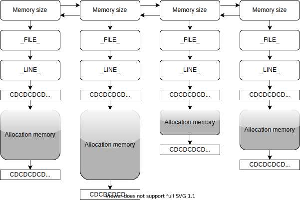

# Alfred
A toy-like module separate from RollingPin for memory management and memory check, named after Batman's butler Alfred. 

Alfred manages memory in the form of the following figure

>**\_FILE\_** and **\_LINE\_** represents the source file name and line number of the current memory space opened.

**More content ~~will be~~ maybe added later**